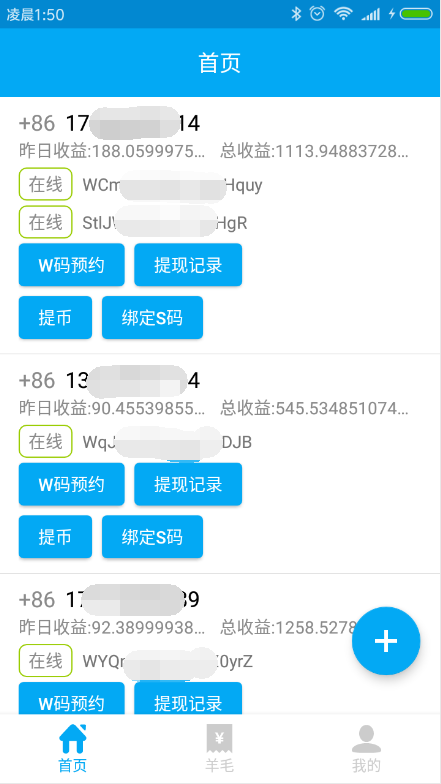

## 简介 ##
BCDN 开源多账号监控管理软件

#### 背景 ####
目前官方的旷机app只能单号登录，且 token 过期时间短，经常需要重新登录，对于多个账号的土豪用户非常不友好。

#### 功能 ####

1. 添加帐号 ( 右上角菜单 )
2. 多账号收益和在线状态查看
3. 收益记录查看 
4. 删除帐号 (右滑 或 子菜单 删除帐号)
5. 撸羊毛 (支付宝红包)
6. 批量预约W码 （右上角菜单）
7. 提币和记录查看
8. 绑定挖矿码

#### 待开发功能 ####
1. 云监控，掉线通知
2. 分享撸羊毛活动

#### 下载地址 ####

点击链接下载

https://github.com/ItTianYuStudio/BcdnWatcher/raw/master/apk/bcdn_miner_v1.0.2.apk

或扫描二维码下载 

#### 截图 ####

## Linux 矿机安装教程 ##

[详情点这里](./minerInstall/README.md)

## 项目详情 ##

#### 架构 ####

采用最新 MVVM 架构，代码优雅，结构清晰。
网络层框架结合最新 Lifecycle 辅助库，避免内存泄漏，减少意外崩溃次数。

#### 技术栈 ####

* 网络访问：Retrofit2 + OkHttp3
* 数据格式：json
* 异步框架：RxJava2 / LiveData
* 数据库：Room
* 设计规范：Material Design
* UI 辅助框架：DataBinding

